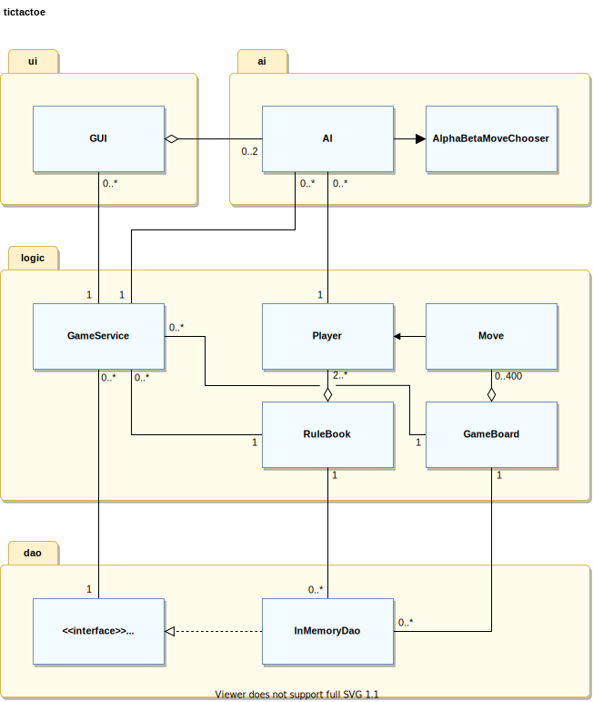

# Implementation document

Project is implemented with [Java](https://dev.java/) (v11.0.11) language together with [Gradle build tool](https://gradle.org/) (v5.1.1) . Graphical user interface utilizes [JavaFX platform](https://openjfx.io/) (v.11.0.2), and unit testing [Junit testing framework](https://junit.org/junit4/) (v.4.13) with [Mockito framework](https://site.mockito.org/) (v3.+).

You can see more comprehensive depenency list with Gradle (run from `<project root>/tictactoe`):
```
./gradlew dependencies
```

## Project structure
Project consists of four main packages (1) `logic`, (2) `dao`, (3) `ai` and  (4)`ui`.

(1) `logic` package holds (quite obviously) functionalities related to logic of the game. Its main class `GameService` handles and collects necessary information related to the game and passes it between main classes of the packages. Additionally `RuleBook` that contains essential rules related information, `GameBoard`, `Player` and `Move` classes that all are used to represent state of the game at given moment are part of logic.

(2) Project has package `dao` to hold data access objects (DAOs) to separate game data from the logic. Package contains so far only one class that implements `Dao` interface; `InMemoryDao` which holds the game data in memory. Such separate package for storing the game data may feel somewhat artificial at the moment but this could enable longer term storing of the data if desirable without interfering other packages. (Well, game is simple at the moment but perhaps this could allow introduction of more complex features in the future).

(3) `ai` (comes from artificial intelligence, AI) package contains functions to generate `AI` player. In practice, so called intelligence is simulated by using minimax algorithm with alpha beta pruning and self-made heuristic methods to evaluate possible moves and find potentially the most optimal one. Actual evualuation is performed by `AlphaBetaMoveChooser`. 
<sub>Notice that package contains deprecated classes `TicTacToeNode` and `GameTreeNodePruner` and interface `GameTreeNode` (which `TicTacToeNode` implements). These were designed to analyze the game tree at given state of the game but were deprecated due to performance concerns; Java is usually faster to perform operations with primitive data structures compared to structures consiting of custom made objects. Concequently, AI maintains the state of the game in primitive integer (`int`) array instead of using `GameTreeNode`s.</sub>


(4) `ui` package provides graphical user interface, `GUI`, via which user can choose game modes and play the game. `GUI` keeps track of `AI` players and requests `AI`(s) to choose move when the game requires, otherwise it propmts move from actual user.  

Relationships between classes are illustrated in class diagram below:



**Figure 1.** Simplefied class diagram of implementation to show relationships between classes. (It excludes deprecated classes and any class specific information about object variables and methods and depricated classes).

## Implemented time and space complexities

By far the most complex part of the project in terms of time is the minimax algorithm that is realized by `AlphaBetaMoveChooser` and used to choose the move for AI player. Therefore, it is justified to focus complexity analysis on that.

When `AI` calls `getMoveWithOptimizedSearchDepth` of `AlphaBetaMoveChooser` following happens:

First `optimizedMaxSearchDepth` is called.  It defines maximum search depth _d_<sub>max</sub>  as a function of number of free tiles on play area as follows:
```java
static int optimizedMaxSearchDepth(int[] area, int playedMoves) {
  int freeTiles = (area[3] - area[1] + 1) * (area[2] - area[0] + 1) - playedMoves;
  if (freeTiles < 9) {
    return 4;
  }
  if (freeTiles < 37) {
    return 3;
  }
  if (freeTiles < 77) {
    return 2;
  }
  return 1;
}
```
Since it only compares the given parameters with predefined values time complexity is constant O(1).
Next `getMove` with bunch of parameters is called. It has two nested for loops:
```java
for (int x = playArea[0]; x <= playArea[2]; x++) {
  for (int y = playArea[1]; y <= playArea[3]; y++) {
```
In practice, code iterates through _x_ and _y_ coordinates within given play area coordinates (`playArea`). Therefore, number of tiles on play area or coordinates to go through is
d _x_\*d _y_ = _n_<sub>play area</sub>. 

However, invalid locations are skipped before any further operations are performed:
```java
if (!validMove(node, playArea, playedMoves, x, y)) {
  continue;
}
```
More precisely, locations that are not on board and such tiles that are not free but also tiles that do not have any neighbouring tile reserved after first move are all skipped:
```java
private static boolean validMove(int[][] node, int[] playArea, int playedMoves, int x, int y) {
  return coordinateOnBoard(node, x, y) //this may not in fact lead to any skips in fact as playArea should be already within the range
          && tileFree(node, x, y)
          && (atLeastOneNeighbourReserved(node, playArea, x, y) && playedMoves > 0);
}
```
As a result, we can reduce the number of tiles that are not next to reserved ones _n_<sub>outliers</sub> and the  number of reserved tiles, _n_<sub>played</sub>, from _n_<sub>play area</sub>. Time complexity depends on input, _n_<sub>free tiles</sub> which is defined as follows: _n_<sub>free tiles</sub> = _n_<sub>play area</sub> - _n_<sub>outliers</sub> - _n_<sub>played</sub>.

Next actual minimax related operations start. We assing new value in given coordinate _x_,_y_ to `node`, call `value` method and revert state to previous after execution returns:
```java
node[x][y] = turn;
int alphaBetaValue = value(node, playArea, new int[]{x, y},
  playedMoves + 1, (turn + 1) % 2, rowLenght, alpha, beta, 0, maxSearchDepth);
node[x][y] = -1;
```
Notice that this enables us to use single `node` array instead of copying it reducing the space complexity of the program. Space needed so far is thus dependent on total number of tiles on board, _n_<sub>board size</sub><sup>2</sup>, where _n_<sub>board size</sub> denotes number of tiles on game board. Furthermore, copying arrays is costly operation on time perspective as well so any additions to time complexity are also avoided.

Now `value` method starts by checking if the observed state is end state:
```java
int maxValue = (int) 1e9 - nodeDepth;
if (lastMoveWinning(node, move, rowLenght)) {
  return (turn + 1) % 2 == 0 ? maxValue : -maxValue;
}
if (gameBoardFull(node, playedMoves)) {
  return 0;
}
if (nodeDepth >= maxSearchDepth) {
  return heuristicBasedOnPlayArea(node, playArea, (turn + 1 % 2), rowLenght);
}
```
Running `lastMoveWinning` checks if there are _k_ marks in row (`rowLenght`) within _k_-1 radius from the location of last move. Thus it only depends on the used _k_ during the game. Space complexity of particular method is constant (O(1)) and time complexity O(_k_).

`gameBoardFull` compares number of tiles on board,_n_<sub>board size</sub><sup>2</sup>, with number of played moves _n_<sub>played</sub> so the complexities are not affected by its input. (Both O(1)).

If maximum search depth _d_<sub>max</sub> is reached without state being final, `heuristicBasedOnPlayArea` is called. This is significantly more complex method than the two previous ones;
it performs 4 nested for loops and assigns 7 temporary variables:
```java
int n = node.length - 1;
int[] playerValues = new int[2];
for (int i = 1; i <= n; i++) {
  int[][][] counters = new int[2][6][rowLenght + 1];
  int offset = 0;
  int[][] marksOnRange = new int[2][n];
  for (int j = 1; j <= n; j++) {
    int[] x = new int[]{i, j, (i + offset), (i + offset - n), j, j};
    int[] y = new int[]{j, i, j, j, i - offset, i - offset + n};
      for (int k = 0; k < x.length; k++) {
        if (x[k] < 1 || x[k] > n || y[k] < 1 || y[k] > n
            || x[k] < playArea[0] - rowLenght - 1 || x[k] > playArea[2] + rowLenght - 1
            || y[k] < playArea[1] - rowLenght - 1 || y[k] > playArea[3] + rowLenght - 1) {
          continue;
        }
        for (int p = 0; p < 2; p++) {
```
First two loops depend on _n_<sub>board size</sub> together resulting in _n_<sub>board size</sub><sup>2</sup> iterations. Then, during each iteration of the first two loops, we assign 6 different coordinates for both _x_ and _y_. This is to go through whole game board horizontally, vertically and diagonally (two directions). Therfore each tile is used in operations four times. After this, we go through from each different starting location and for both players the coordinates. However, such locations that are further than _k_-1 tiles from current play area or entirely outside board are skipped. Consequently, total number of tiles that are observed is 2\* (d _x_+ 2(_k_-1)) \* (d _y_ + 2( _k_-1)) = 2 d _x_ \* d _y_ + 4(k-1)d_x_ + 4(k-1)d _y_ + 2(2(k-1))<sup>2</sup>. = 2 _n_<sub>play area</sub> + 4(k-1)d _x_ + 4(k-1)d _y_ + 2(2k-2))<sup>2</sup>. This equals time complexity of O(_n_<sub>play area</sub> + _k_). Combined with the time complexity resulting from the first two loops, we end up with complexity of O(_n_<sub>board size</sub><sup>2</sup> * (_n_<sub>play area</sub> + _k_))

In terms of space, assigned variables lead to following complexities
- `n`, `playerValues`, `offset` : constants => O(1)
- `counters`: 2 \* 6 \* (_k_+1) => O(_k_)
- `marksOnRange`: 2 \* _n_<sub>board size</sub> => O( _n_<sub>board size</sub>)

Next, during each iteration algorithm checks if currently observed player has placed mark on observed location, update counters correspondingly and heuristic value of player in question:
```java
if (node[x[k]][y[k]] == p) {
  if (marksOnRange[p][k] < rowLenght) {
    counters[p][k][++marksOnRange[p][k]] = rowLenght;
  }
}
if (marksOnRange[p][k] > 0
  && observedRangeFullyOnBoard(x, y, k, n, rowLenght)
  && marksOnRange[((p + 1) % 2)][k] == 0) {
  playerValues[p] += Math.pow(10, marksOnRange[p][k] - 1) - ((p + turn + 1) % 2);
}
  counters[p][k] = reduceMarkCountersByOne(counters[p][k]);
if (marksOnRange[p][k] > 0 && counters[p][k][marksOnRange[p][k]] == 0) {
  marksOnRange[p][k]--;
}
```
Only operation of which time complexity is affected by the input is `reduceMarkCountersByOne` since it iterates through values of array with lenght of _k_+1. Hence, its time complexity is O(_k_) resulting in time complexity of O((n<sub>board size</sub><sup>2</sup> * (n<sub>play area</sub> + k)) \* k) of `heuristicValueBasedOnPlayArea`.

After these, loop continues, value of `offset` is increased and eventually final heuristic value, calculated from difference of player specific values (`playerValues`) is returned.

Finally we get back to `value` method. Likewise `getMove`, it iterates through given play area although this time tiles just outside the play area are checked. Yet again invalid moves are skipped according to `!validMove` check resulting in same method of calculating _n_<sub>free tiles</sub> as above. Though, this does not remain constant as play area can grow and on the other hand number of played moves depend on current search depth. We can simplify by denoting _n_'<sub>free tiles</sub> ≈ b, where _n_'<sub>free tiles</sub> is number of free tiles when `value` is called and _b_ is branching factor (discussed earlier in [project specification](./project_specification.md)).

To avoid increasing time and space complexities due to copying of arrays, same `node` as given in parameters is used. Correspondingly, same `playArea` variable is also used. However, since we want to revert it back to original state after recursions, its updated state information is kept in additional `areaChanged` boolean array. It has always size of 4 but since `value` calls recursively itself, it lead to space complexity of O(4 \* _b_ \* _d_) where _b_ is branching factor (as mentioned above) and _d_ search depth (which also discussed in [project specification](./project_specification.md)). 

 As we use maximum search depth _d_<sub>max</sub>, we know that _d_ <= _d_<sub>max</sub>. Thereby, in the worst case space complexity becomes now O(_b_ \* _d_<sub>max</sub>) (we can ignore constant 4).`increasePlayArea` or `decreasePlayArea` operations to `areaChanged`, instead, do not have significant affect on either complexity.

As mentioned above, `value` calls itself thus leading to worst case time complexity of O(_b_ <sup>_d_<sub>max</sub></sup>). However, since we are using alpha beta pruning
```java
  if (turn == 0) {
    value = Math.max(value, alphaBetaValue);
    alpha = Math.max(alpha, value);
  } else {
    value = Math.min(value, alphaBetaValue);
    beta = Math.min(beta, value);
  }
  node[x][y] = -1;
  decreasePlayArea(playArea, areaChanged);
}
if (alpha >= beta) {
  return value;
}
```
we may potentially achieve faster evaluation times if nodes are iterated in such order that pruning takes place. We know from [project specification](./project_specification.md) that in best case, this can lead to O(_b_ <sup>d/2</sup>).

After value is calculated (either with or without pruning), execution returns to `getMove`. This too has similar method of recognizing pruning potential, halt execution and return found move when further iterations are no longer needed:

```java
        if (turn == 0) {
          if (value <= alphaBetaValue) {
            value = alphaBetaValue;
            move[0] = x;
            move[1] = y;
          }
          alpha = Math.max(alpha, value);
        } else {
          if (value >= alphaBetaValue) {
            value = alphaBetaValue;
            move[0] = x;
            move[1] = y;
        }
        beta = Math.min(beta, value);
      }
     if (alpha >= beta) {
        return move;
    }
  }
}
return move;
```
As a result, `value` is called _n_<sub>free tiles</sub> - _n_<sub>pruned</sub>  times where _n_<sub>pruned</sub> is number of moves pruned and 0 <= _n_<sub>pruned</sub> <= _n_<sub>free tiles</sub>-1. Since `value` uses similar criteria to choose child nodes, we can similarly as with `value` denote _n_<sub>free tiles</sub> ≈ _b_. Thus, combined time complexities of `getMove` and `value` are O(_b_<sup>(d+1)/2</sup>), where d<= d<sub>max</sub> (best case) and O(_b_<sup>d<sub>max</sub>+1</sup>) (worst case). 

We are almost there. We still need to take into account for space complexity that in addition to `node` array that is passed from `AI` to `AlphaBetaMoveChooser` (together with other parameters), program needs to maintain the actual state of the game. Space complexity depends in that case the game configuration: game board size, players, played moves, rules. Despite the progress of the game, space complexity is actually O(_n_<sub>board size</sub><sup>2</sup>). Notice that `GUI` also requires certain amount of memory but we will estimate it to be O(1).

Finally, by combining derived complexities (other than O(1)) of all the methods we get:

**Time complexity**

Worst case
> O((n<sub>board size</sub><sup>2</sup> * (n<sub>play area</sub> + k)) \* k \* _b_) \[`heuristicBasedOnPlayArea`, calculated in all final _b_<sub>max</sub> nodes\] + O(k \* b<sup>d<sub>max</sub>+1</sup>) \[`lastMoveWinning`, checked during every iteration\]

Best case
>  O(k \* (b<sup>d<sub></sub>+1)/2</sup>) \[`lastMoveWinning`, checked during every iteration but all visited nodes are end states so `heuristicBasedOnPlayArea`is not executed\]

By taking into account that we have defined n<sub>board size</sub>=20 and _k_=5 we can simplify both cases:

Worst case
> O( _b_ ) + O(b<sup>d<sub>max</sub>+1</sup>) = O(_b_ + _b_<sup>d<sub>max</sub>+1</sup>) =  O(_b_<sup>d<sub>max</sub>+1</sup>)

Best case
>  O(b<sup>d<sub></sub>+1)/2</sup>)
where _d_ <= d<sub>max</sub></sup>.

**Space complexity**

Worst case:
> O(_k_ + _n_<sub>board size</sub>) \[temporary counters of`heuristicValueBasedOnPlayArea`, needed only while calling it\] + O(_b_ \* _d_<sub>max</sub>) \[`areaChanged` in `value`\] + O(_n_<sub>board size</sub>) \[ game state \]

Best case
> O(_b_ \* _d_) \[`areaChanged` in `value`\] + O(_n_<sub>board size</sub>)

Again, by taking into account that we have defined n<sub>board size</sub>=20 and _k_=5 we can simplify both cases:

Worst case:
> O(_b_ \* _d_<sub>max</sub>)

Best case:
> O(_b_ \* _d_)
where _d_ <= d<sub>max</sub></sup>.

**Conclusion**

It is worth noting that branching factor _b_ is specific for this application and due to measures to reduce the number of potential branches per node, is potentially smaller than branching factor in project specification, let use _b'_ for it this time. So _b_ <= _b'_ (but most likely _b_ << _b'_). Additionally search depth _d_ is limited to _d_<sub>max</sub> that in turn is maximum 4. Thereby we can confidently say that realized complexities are within the expectations  laid in project specification.

## Possible flaws and ideas for improvements
- It is worth considering further optimization of maximum search depths based on observations done in [performance testing](https://github.com/toniramo/tic-tac-toe/blob/main/documentation/testing_document.md#results).
- There is potential to improve move choosing algorithm further, e.g. by utilizing iterative deepening and/or changing the order of nodes to increase likelyhood of finding the most valuable node early on - for instance starting from moves closest to the latest moves.
- Used heuristics may simplify the game, at least 'like iterate through only those tiles that are adjacent ot reserved tiles'. This could be revised and changed to something more complex since it is possible that sometimes the most optimal move is found elsewhere. Of course, abandoning this rule as it is now may require increasing the the performance of the algortihm in some other means to compensate the change.
- Take into account human element in game: it is possible that opponent does not notice already achieved victory (e.g. | |X|X|X|X| |). In such case AI may just ''give up'' i.e. choose last of the observed moves since all are equally bad based on algorithm.
- UI may show transparent mark in AI vs. AI game even after first and only user made move is made.

## Sources
- https://en.wikipedia.org/wiki/Minimax
- https://en.wikipedia.org/wiki/Alpha%E2%80%93beta_pruning
- https://en.wikipedia.org/wiki/Branching_factor
- https://en.wikipedia.org/wiki/M,n,k-game
- http://www.cs.umd.edu/~hajiagha/474GT15/Lecture12122013.pdf
- https://cis.temple.edu/~vasilis/Courses/CIS603/Lectures/l7.html
- Introduction to Artificial intelligence course material, [part 2](https://materiaalit.github.io/intro-to-ai/part2/)
- StackOverflow with error cases.
