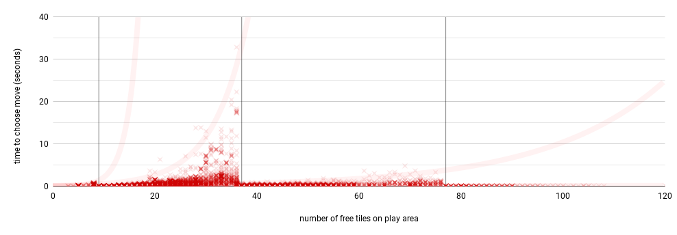

# Testing document

## Maintaing quality 
Unit level testing is carried out with JUnit and partially supported with Mockito library to mock other classes when appropriate. 

More information about testing coverage is [below](#unit-test-coverage-status) and in Codecov, navigate via this badge:

> [](https://codecov.io/gh/toniramo/tic-tac-toe)

Tests are run and badge is updated every time new commit is made and pushed to Github based on jacoco test report.

Focus in automated testing development has been in the most important and complex classes, exluding the graphical user interface that is tested manually.

Additionally quality has been monitored with continuous CI with Gradle workflow (thanks to which actually also the Codecov is updated). It updates the CI status not alone based on test results but also other quality factors like compliance with configured checkstyle rules. See status by monitoring this badge: 
> 

### Unit test coverage status

Summary of test coverage on 29.10.2021 13:00:


| Package/Class  | Complexity<sup>1</sup> | Coverage<sup>2</sup>  | | ☰ Tracked lines   |  🟢 Lines hit | 🟡 Lines partials  | 🔴 Lines missed  |
| ------------- | ------------- | ------------- | ------------- | ------------- | ------------- | ------------- | ------------- |
| **tictactoe**     | **84%**  | **90%** | |**398** | **360** | **19** | **19** |
| tictactoe/**ai**   | **92%**  | **96%** | |**195**	| **187** |	**6** |	**2** |
| [AI.java](https://app.codecov.io/gh/toniramo/tic-tac-toe/blob/main/tic-tac-toe/src/main/java/tictactoe/ai/AI.java)   | 95%  | 98% | | 52	| 51	| 1	| 0 |
| [AlphaBetaMoveChooser.java](https://app.codecov.io/gh/toniramo/tic-tac-toe/blob/main/tic-tac-toe/src/main/java/tictactoe/ai/AlphaBetaMoveChooser.java)   | 95%  | 98% | | 143 |	136 |	5 |	2 |
| tictactoe/**logic**   | **75%**  | **86%** | | **187** |	**160**	| **13**	 | **14** |
| [GameBoard.java](https://app.codecov.io/gh/toniramo/tic-tac-toe/blob/main/tic-tac-toe/src/main/java/tictactoe/logic/GameBoard.java)  | 74%  | 94% | |	35	| 33	| 2	| 0 |
| [GameService.java](https://app.codecov.io/gh/toniramo/tic-tac-toe/blob/main/tic-tac-toe/src/main/java/tictactoe/logic/GameService.java)  | 83%  | 96% | | 73	| 70	| 1	| 2 |
| [Move.java](https://app.codecov.io/gh/toniramo/tic-tac-toe/blob/main/tic-tac-toe/src/main/java/tictactoe/logic/Move.java)  | 58%  | 63% | |	27	|  17	| 5	| 5 |
| [Player.java](https://app.codecov.io/gh/toniramo/tic-tac-toe/blob/main/tic-tac-toe/src/main/java/tictactoe/logic/Player.java)  | 64%  | 77% | 	| 26	| 20	| 2	| 4 |
| [RuleBook.java](https://app.codecov.io/gh/toniramo/tic-tac-toe/blob/main/tic-tac-toe/src/main/java/tictactoe/logic/RuleBook.java)  | 75%  | 77% |  |	26	| 20 | 3 | 3 |
| tictactoe/**dao**  | **80%**  | **81%** | | **16**	| **13** | **0** |	**3** |
| [InMemoryDao.java](https://app.codecov.io/gh/toniramo/tic-tac-toe/blob/main/tic-tac-toe/src/main/java/tictactoe/dao/InMemoryDao.java) | 80%  | 81% | | 16	| 13	| 0	 | 3 |

<sup>1</sup>  Coverage of branches in code, <sup>2</sup>  Coverage of code lines

Test coverage progress during the course:



### Running unit tests

As mentioned in section [Checks, tests and reports](https://github.com/toniramo/tic-tac-toe/blob/main/documentation/user_guide.md#checks-tests-and-reports) of the user guide, you can run unit tests from `<project root>/tictactoe`with command
```
./gradlew test
```

If you wish to generate also testing reports, you can execute following command:
```
./tictactoe/gradlew check
```
This runs checks (checkstyle) and units test and generates related reports:
   - Output reports for checkstyle, `main.html` and `test.html`, will be found from `./build/reports/checkstyle`.
   - Jacoco test report is generated in `./build/reports/jacoco/test/html`. You can see main page of the report by opening `index.html`.

## Validating AI
Competence of the AI (or minimax algoritm that it is based on) is evaluated both manually and in automated manner. 

Manual testing takes place via user interface (UI) with game modes "Human vs. AI" (human player starts), "AI vs. human" (AI starts), and "AI vs. AI" (actually partially automated since AIs play against each other) as AIs moves are observed, and in case of first two modes, also challenged by human. Higher level, though somewhat vague, criteria is that AI should provide considerable challenge for the other player. More precicely, this means that it should strive for win and choose obvious winning move if available or move that enables winning. Additionally, since the goal is to win and not loose, AI should counter other player's winning move if possible. Of course, eventually it may loose while game board becomes more complex as the algorithm is not able to calculate whole game tree and optimal move is partly evaluated by self-made [heuristic](https://github.com/toniramo/tic-tac-toe/blob/951a5f7fa3ccbc18bea8dac81f3d9b42b89210a0/tic-tac-toe/src/main/java/tictactoe/ai/AlphaBetaMoveChooser.java#L326) that is just a simple _estimate_ about possible value of observed move (or game tree node). Another criteria during the actual game play relates to performance; it should not take too long for AI to choose the move. Yet again, it is subjective what is "too long" but for sure no more than some seconds. This is studied [below](#perforance-of-ai). 

Automated validation is performed with JUnit automated tests found in [src/test/java/tictactoe/ai](https://github.com/toniramo/tic-tac-toe/tree/main/tic-tac-toe/src/test/java/tictactoe/ai). Cases ensure that AI, depending on case, either chooses winning move or counters that of other's. Cases include various starting locations and row directions. 

### Performance of AI

Performance of AI is tested with [AIPerformanceTest.java](https://github.com/toniramo/tic-tac-toe/blob/main/tic-tac-toe/src/test/java/tictactoe/ai/AIPerformanceTest.java). It is excluded from regular test cycle and should be executed separately with command line:
```sh
./gradlew performanceTest
```
During the test, AI vs. AI games from all possible starting positions ((1,1),(1,2),...,(20,20)) are played and certain key measurements are logged in resulting test file `./tictactoe/build/reports/tests/performanceTest/data/perfTest_*txt`.

Notice that it takes up to **1.5 - 2.0 h** to run the test.

#### Results

Based on [run on 21.10.2021](./test_data/performance_test_20211021.txt) (see [figure 1](#figure1)), performance of the AI is decent; move is in majority of cases chosen in less than 5 seconds even with less strict limits of 3 and 4 for search depth. In fact, most of the measured move evaluation times are well below 1 second average being around 0.6 seconds. 

High extremes are also seen during the test, though rarely; occasional peaks of up to and above 10 seconds are seen with maximum search depth of 3. The most extreme observation is even above 30 seconds. These moves with more than 10 second evaluation time accounts for 28 out of 7792 or less than 0.4% of moves made during the test so the impact to overall gaming experience is very limited.


<a name="figure1"></a>
**Figure 1.** Move evaluation time of AI by number of free tiles on play area. Each transparent red X represent observation and transparent red trendlines exponential trends of observed worst cases per each search depth. Vertical grey lines (|) indicate the thershold values between used search depths (4:\[0,8\], 3:\[9,36\], 2:\[37,76\], 1:\[77,\[)

##### Realized complexities based on data

As we know from [project specification](https://github.com/toniramo/tic-tac-toe/blob/main/documentation/project_specification.md#expected-time-and-space-complexities-of-the-program), time complexity of the algorithm depends on branching factor b (in practice number of free tiles within observed play area) and search depth d (limited by used maximum search depth, see [this method](https://github.com/toniramo/tic-tac-toe/blob/179c57bc7a7026f39a7717c85384f284690b3620/tic-tac-toe/src/main/java/tictactoe/ai/AlphaBetaMoveChooser.java#L132)). In the worst case, time for each evaluation is roughly O(b^d). The exponential nature of the equation is evident in trendlines of figure 1 that are fitted to most extreme observations. Then again, the best case complexity is about O(b^(d/2)). As indicated above, the result is mostly closer to the lower end due to many measures taken in code to optimize the search time: 
(i) use of alpha-beta pruning together with 
(ii) choosing only tiles adjacent to reserved tiles (within play area) and
(iii) using adaptive search depth. Additionally, as the game progresses enough, it becomes increasingly likely that the game ends so end leafs of game tree are found sooner and search is terminated earlier.

##### Additional observations

Even though the focus is on performance, some additional validation can be done during the test and from the output data. For instance, test checks every chosen move and ensures it is within the game board. The data in turn indicates that the first AI player, since having the advantage of having the first move, wins most of the games as expected; out of 400 games first AI wins 284 (or 71%). Is is likely that some starting moves that the first player is forced to play are not optimal for winning (like corners) and gives the advantage to the second player potentially justifying the most of the outcomes of the 116 lost games. Another interresting measure is game lenght. With two equally strong players, it does not necessarily provide any details of the competence of either one but may still be worth monitoring. Though, at least if both players are doing their best, the game should last most of the time longer than 9 moves which lenght of the shortest possible game (first player gets 5 in row on her fifth turn). In this case, game lenghts ranges from 9 to up 81 average being 20.5. Shortest possible game happens only once.

##### Discussion

It is worth considering how strict requirements are placed on the maximum search time. That is, as is the case now, we have fairly decent AI with _mostly_ fast decision time. Is it fine if very ralely longer searching times are seen or should those be avoided entirely? If requirement should be strict, we could avoid the extremes for instance by lowering the threshold between search depths of 3 and 2 to 25 to achieve maximum 10 seconds waiting times (and correspondingly threshold between 4 and 3 could be increased to 12 and that of between 2 and 1 to 100) as illustrated in figure 2 below. Personally, I am satisfied with the current implementation and have not seen such dramatic waiting times that would significantly hinder the gaming experience in actual game play.


**Figure 2**. Possible new, observation based thresholds for maximum search depths if maximum allowed evaluation time is set to 10 seconds (4:\[0,11\], 3:\[9,24\], 2:\[25,99\], 1:\[100,\[)

