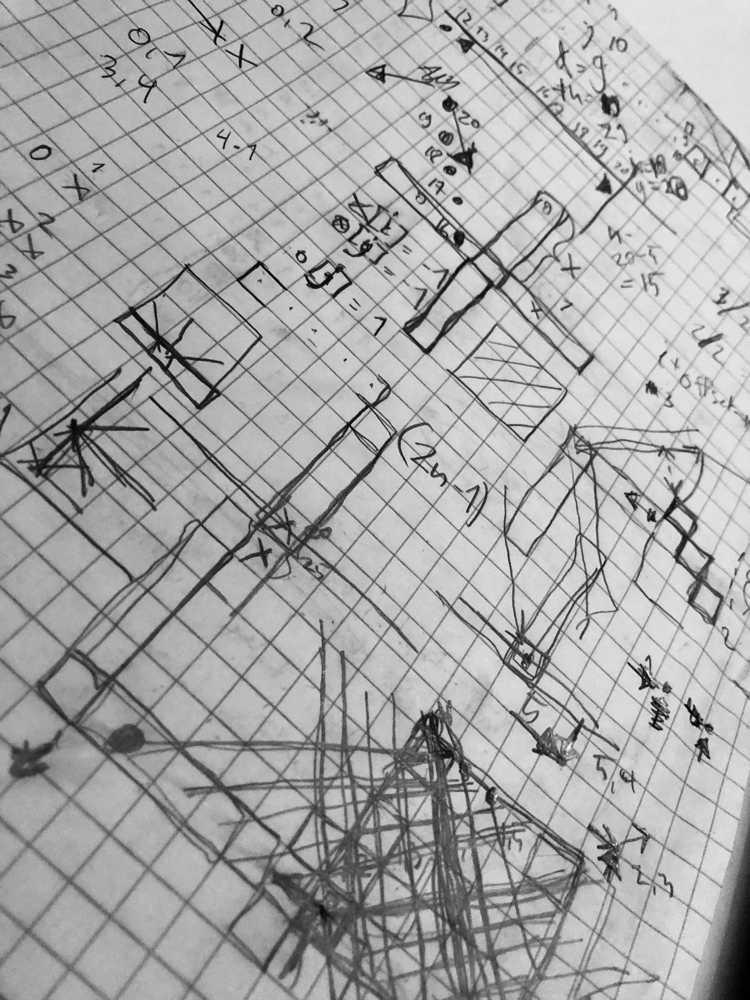

# Week 3

Main theme for this week was to build foundations for AI player that will use minimax with alpha-beta pruning to figure out best possible move on each turn. Interrestingly, Introduction to AI course had this week [topics](https://materiaalit.github.io/intro-to-ai/part2/) covering this exact theme so it gave nice warm up for the implementation work. 

When I started to shape the structure (needed classes and their methods), it soon became clear that the current project structure was not supporting the need in the best possible way. For instance, all the game data was stored behind Dao object. I first though of simulating each game tree node (used with the algorithm) by creating new instances of GameServices and Daos but it soon started to feel somehow wrong. I encountered problems like how to copy an object in Java? is it safe to use and modify the copy (that is, is it just a reference to the original object or new with own memory address)? In one thread of Stackoverflow conserning topic of copying object, the most upvoted commenter stated something like this: '' your case is real example of when object oriented programming has gone very wrong if you need to copy object''. Well, I guess it cannot be entirely avoided since at least my case I need multiple copies of known state. It is just harder and more complex - and most cases should be avoided - if objects to be copied contain many other objects and so on. Thereby, I decided to refactor the base program and create couple of new classes (GameBoard and RuleBook) to communicate only the most essential information to the game nodes. It felt better option after all.

Another essential task before starting to implement actual algorithm, I needed to come up with some heuristic and method to evaluate that on given board for those nodes (actually most of the nodes) that are at the maximum search depth but not yet actual end states of the game. Coming up with ideas was not necessarily problem but finding ways to communicate those with Java in an appropriate way for sure needed drafting (see related picture below). Luckily, during the process, I also noticed a mistake in the excisting method that checks for the winner (i.e. there are actually 2*n-1 diagonals in one direction to go through in comparison to n rows or columns on each cycle). By the way, in the end, there seemed to be similar structure in counting heuristic value and checking winner. I am wondering if these kind of methods could share part of the code, and define own submethod at core of for and if loops.

Naturally, after introducing new classes and performing refactoring to the excisting code base, JavaDoc was updated and new test cases were written. Though, even more, complex cases would be beneficial to create. 

Estimation of time used this week: about 20 h.

